# 发源链白皮书
## [FinndyChain-WhitePaper](https://finndychain.io/assets/pdf/FinndyChain-Whitepaper-Latest-CN.pdf)
### 基于超级智能合约的数据生态系统
##### 关键词：数据挖矿、超级智能合约、DPoW、安全交付、AI建模、侧链存储、授权确权、技术脱敏、切片融合    

###### V1.20    
###### 2018-07-01    

### 前 言 
### 1、项目背景  
#### 1.1 当前存在问题 
#### 1.2 区块链的价值 
#### 1.3 项目社会愿景 
### 2、发源链生态方案   
#### 2.1 发源链架构  
#### 2.2 超级智能合约 
#### 2.3 侧链存储   
#### 2.4 数据挖矿模型 
#### 2.5 数据生态架构 
### 3、发源链应用市场   
#### 3.1 DApp1.数据交易平台   
#### 3.2 DApp2.分布式采集终端  
#### 3.3 DApp3.精准营销平台   
### 4、Token经济模型    
#### 4.1 应用场景   
#### 4.2 Token发行方案  
#### 4.3 资金使用规划 
#### 4.4 投资优势分析 
#### 5、团队构成 
#### 5.1 核心团队   
#### 5.2 投资人及VC机构  
#### 6、发展与规划    
#### 6.1 发展历程   
#### 6.2 时间规划   
#### 7、项目声明 
#### 8、参考文献     
    
### 前 言    

近年来，随着互联网经济的高速发展和信息系统及数据库技术的普及，人类社会活动中的越来越多的内容被数字化记录，各个行业和机构所产生的数据呈指数型增长。同时，大数据、云计算及人工智能技术的快速发展极大地提升了人们对数据的加工效率，降低了数据处理成本。数据已成为新时代的石油，正在颠覆各行业的发展。社会从 IT 时代转变为 DT 时代。    
   
未来，人们可以低成本、多终端、多维度采集各类数据，海量存储于某个系统中完成业务目标的存量数据源可能通过整合后再融合，打破数据孤岛，成为其他外部信息系统或决策所需的数据资源，并且其价值可以在流通后再次得到应用，从而产生更多的应用价值，提升人类社会的数据利用率。因此，随着大数据产业市场规模的迅速扩大，建立有效的数据生态系统，发掘数据源头背后的价值，让数据标准化地流通应用成为大数据时代的重要任务。    

现在，区块链的诞生与发展恰恰给了时代最好的机会。区块链狭义上是一种按照时间顺序将数据区块以顺序相连的方式组合成的一种链式数据结构， 并以密码学方式保证的不可篡改和不可伪造的分布式去中心化的数据库。广义来讲是利用链式数据结构来验证与存储数据，利用分布式节点之间的共识算法来生成和更新数据、利用密码学的方式保证数据传输和访问的安全、利用由自动化脚本代码组成的智能合约来编程和操作数据的一种全新的分布式计算机技术的新型应用模式。    

因此，本质上作为一种数据库技术的区块链和数据本身完美匹配，耦合程度相比区块链与其它领域的结合要高很多。同时，区块链的去中心化、匿名性、不可篡改、共识机制等特征恰恰可以完美解决了大数据产业落地过程中的几个关键痛点。   
 
本白皮书是发源链团队结合多年来在大数据采集、流通及应用领域的成熟实践与探索创新，基于区块链实现的一种去中心化数据生态的解决方案。旨在打造一个以大数据作为生产资料、人工智能AI作为生产力、区块链作为生产关系的合规有序的数据生态体系。     

### 1、项目背景
#### 1.1 当前存在问题

数据作为生产资料已成为大数据整个产业链的底层基础设施。随着数据的重要性日益提升，数据的采集加工及流通应用环节是未来大数据行业能快速落地，数据资产能价值最大化的必要条件。当前，大数据领域主要存在的问题有如下几点：    

##### 1.1.1 版权隐私无保障

众所周知，数据具有可复制的特点，可通过计算机快速 Copy 进行传播，且流通不透明。无论是公开网络上的数据还是企业内部非公开的数据，在数据的版权隐私方面目前都很难做到完全可控。公网数据的版权问题，也一直未能得到完善解决。企业内部的数据也经常被公开到网络上，从而导致数据资产的泄露且没有任何版权声明。隐私安全方面，近年来已出现多起由于个人隐私数据泄露导致的各类相关刑事案件问题。各国政府职能部门在不断建立有效合规的政策方案，以促进整个社会数据资源的合规流通。同时，作为相关平台方也需要建立一套完善的数据确权授权流通应用体系和完善的技术脱敏方案，才能从根本上保证数据有清晰的所有权关系和隐私安全问题的完美解决。    

##### 1.1.2 采集加工成本高

行业研究显示，整个互联网每天近六成以上的流量来自于网络数据的爬虫或定向采集。数据源方的数据被采集的同时服务器还承担非常高的负载，数据需求方为了自身业务需求，需投入大笔费用从网络上采集各类数据，且后续的加工也需要不断地投入成本。当前大数据时代，数据的维度、数量及时效性是衡量数据价值的关键因素，数据的整合及融合加工程度将决定它对社会发挥多大的价值。开放共享是互联网的核心特征，未来数据经过授权、脱敏、加工都将可低成本、高效率流通应用，在保障数据源方获得收益的同时需求方也将无需花费过多的成本。互联网将从传统 IT 时代的内容变现，逐步转变为 DT 时代的数据变现。    
    
##### 1.1.3 复用率低且孤岛严重

随着云计算及数据采集技术的快速发展，社会沉淀的数据规模越来越大。然而没有有效的平台让这些沉淀的数据得以充分发掘并复用。企业及政府机构都拥有海量有价值的数据源，但由于数据没有明确的版权归属界定且数据流通过程中存在信任机制问题，导致数据源渠道不愿意互通数据，更无法进行数据的融合关联。因此导致数据的利用率低，且各数据源渠道直接的数据孤岛现象严重。要想从根本上解决复用及孤岛问题，就需要在保障数据的所有权方长期获益的基础上，建立一个良好的数据流通体系。    

#### 1.2 区块链的价值

从“互联网+”到“区块链+”，技术革新推动时代进入了区块链应用元年。从价值投资的角度出发，匹配程度高、真正利用区块链的精髓解决行业痛点的项目才拥有可持续的生命力， 并创造出符合人们预期的价值！区块链核心特征与数据生态存在的问题比较如下图所示：     

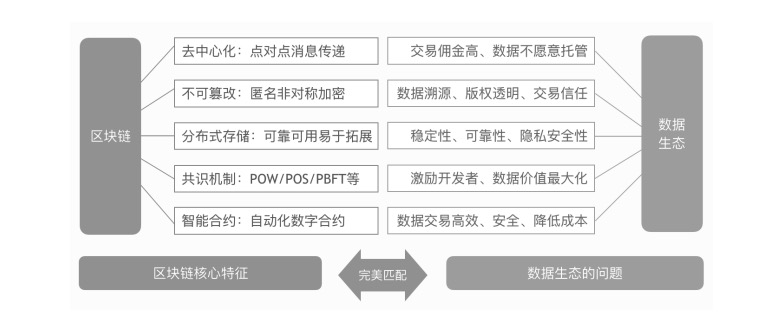

区块链本质是分布式的去中心化数据库，数据生态的主体是数据，且数据 HASH 上链与数据本身是100%耦合，不存在被篡改的过程，这些决定数据上链具有其它任何产品都不具有的优势。同时，区块链的引入，将传统中心化升级为去中心化的模式，在数据流通应用过程中具有颠覆性的意义。具体引入区块链解决的痛点如下表：    

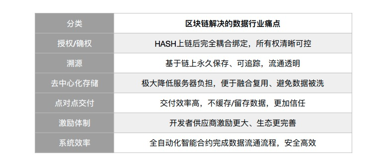   

#### 1.3 项目社会愿景

发源链（FinndyChain）旨在打造全球最大的区块链数据生态系统，通过区块链来发掘数据源头背后的价值。发源链基于区块链去中心化网络节点连接全球数据源头，使用侧链技术进行数据的分布式切片存储，将数据源永久存储且多次复用，实现数据的“去中心化存储，点对点交付”。发源链引入完善的通证（Token）经济模型能够最大化激励平台各方积极参与生态建设。数据流通基于发源链首创的“授权+脱敏+确权”三元素流通准则进行。同时，系统提供成熟完善的分布式数据采集引擎，使得数据接入、流通及应用合规、安全、高效，以最好的体验和最低的成本帮助数据供需双方接入平台，快速实现数据价值最大化。        

发源链团队拥有多年领先的大数据交易平台实践的经验和成熟的技术沉淀，是国内最早一批使用区块链技术进行实践探索的团队。基于分布式数据存储技术连接过全球百万级数据源节点的高速运转和流通，开发过全球领先的分布式数据采集引擎，同时对数据采集、流通及应用过程中的痛点有深入的理解。    

发源链是区块链应用于数据领域最革新的实践，基于颠覆性的区块链技术构建的数据生态圈将成为数据行业的一站式入口平台，包括数据的接入、存储及应用。最终通过区块链实现：链接全球所有数据开发者用户和数据节点进行“数据挖矿”并产生流通、让数据源方的数据价值最大化、让数据需求方低成本高效率使用数据的愿景！    

### 2、发源链生态方案 

发源链数据生态主要包括区块链主链侧链、超级智能合约、数据存储系统及DApp应用市场，不仅能满足以太坊及EOS等公有链的基础功能，还能链接全球数据源，实现海量数据资产的沉淀并应用，最终将形成全球化的大数据生态管理系统。    

#### 2.1 发源链架构

发源链是基于 DPoS+DPoW 共识算法专门为数据行业研发的底层公有链。发源链基于石墨烯 (Graphene) 技术架构开发，拥有3秒的出块时间，高达10万的 TPS。性能远高于比特币或以太坊的底层区块链。发源链基础模块的层级架构如下图所示：   
 
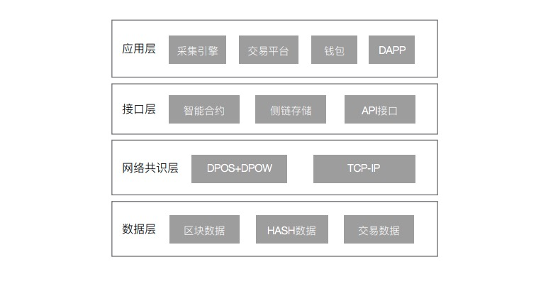  

DPoS (Delegated Proof of Stake) 机制也是源于石墨烯，中文名叫做股份授权证明机制。原理是让每个持币人投票产生21个代表节点并定义为超级节点，它们的权利完全相等的且可无限扩展。DPoS 机制类似议会制度或人民代表大会制度，如果代表不能履行他们生产区块的职责，则会被除名。网络从备用节点中选出新的超级节点来取代他们。DPoW (Data Proof of Work) 共识机制是发源链针对数据领域设计的底层区块链生态共识模型，基于比特币类工作量证明PoW基础上改进，使用开发者用户消耗脑力的算法代替传统消耗纯计算机算力的 Pow 算法，实现“数据挖矿”的创新共识模型。发源链是新一代的数据领域的底层区块链架构，针对数据生态的做出针对性设计。主要特色优势如下：   

- **创新共识**： 首创 DPoS+DPoW 混合共识，社区自治性更强；   
 
- **超级合约**： 超级智能合约。即人工智能化、专为数据生态设计的接口；  
  
- **数据挖矿**： 完善的“数据挖矿”算法设计，激励更完善，生态更健全；    

- **侧链存储**： 生态中的沉淀的数据资源通过侧链进行去中心化存储；    

- **独立架构**： 沉淀的数据资源和业务数据分离，保证架构性能；  
  
- **应用市场**： DApps 链上使用方案，完美解决裸数据交付带来的版权隐私问题。   

#### 2.2 超级智能合约
    
发源链超级智能合约本质是一套数字化定义并能自动执行的承诺协议，用于操作链上数据的可编程接口规则。提供GUI模式和开发者模式，以满足不同类型的用户需求场景，便于极速完成应用开发。发源链智能合约针对数据行业特点做出相应的设计，具体合约特色如下：   
     
- **极简开发**：8分钟开发 DApp。可视化 GUI 合约编辑器及模板开发环境，无需编程基础；   

- **安全性强**：高容错性、高原子性的设计，极大提升安全性，降低 BUG 出现几率；    

- **AI自建模**：内置上千种大数据应用模型，无缝对接 DApp，完成数据链上安全交付；   
 
- **性能完善**：针对数据行业优化，且以机器码方式执行，具有良好的性能和执行效率。   
 

发源链超级智能合约，专门为发源链数据生态设计。应用场景示例如下：     

- **数据标识**：数据开发者根据所要发布的数据文件属性，生成数据身份，包含数据的各类特殊属性，如数据类型、数据维度等。 
   
- **HASH上链**：数据开发者根据数据发布合约的模版，将数据身份散列加密后写入合约，向区块链发送创建智能合约请求。   
 
- **特征校验**：平台对合约中各类特殊属性完成核实校验，避免出现基础质量或安全问题。通过后对该合约进行签名，完成数据发布合约。    

- **查询检索**：数据需求方可通过区块链检索、查阅意向数据，进行数据复用。并可根据合约模板，向区块链提交查询检索请求。 
 
- **安全溯源**：数据流通的发起，都需经过数据开发者的应答和审批。流通过程中的操作都根据合约中约定的策略依次自动执行，并进行链内共识、记录。数据持有方可从区块链中读取批准合约的操作记录，以实现监控、核验和审计。    

- **合约签署**：合约中规定的各参与方在本地区块链收到智能合约请求，并进行签署。平台在签署前，需确认各个参与方资质。   

- **融合关联**：数据开发者将结果提交到区块链合约中。对于多个数据开发者完成的切片任务，由合约根据AI建模完成结果的汇总融合，之后数据需求方从区块链获取计算结果。    

- **数据交付**：数据需求方根据合约的授权签名、使用权确权等要求，执行数据计算。根据数据授权等级确定数据在使用过程中是否需在数据沙盒环境中进行，最终完成交付。    

#### 2.3 侧链存储

数据生态系统存在海量数据的存储，如果将全部数据走主链存储必然会影响整体性能，且区块会非常庞大。侧链概念是相对于主链提出的，主要用于解决主链不适合完成的业务需求。类似于两个独立的数据库。发源链的侧链存储基于 IPFS 开发，实现数据的切片存储和融合交付。具体数据接入流通流程图如下所示。     

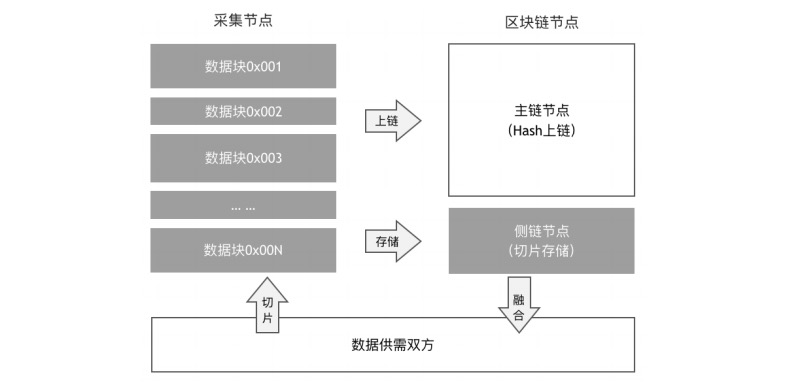     

#### 2.4 数据挖矿模型    

发源链的 DPoW 共识机制是基于发源链首创的“数据挖矿”模型设计。DPoW “数据挖矿”旨在解决大数据时代数据矿山利用率极低和数据孤岛现象严重的问题。互联网前十年是数据沉淀的十年，互联网、企业及政府机构都沉淀了海量有价值的数据，但这些数据大多没有被充分发掘利用。系统提供的面向开发者 (ToD) 和面向普通大众用户 (ToC) 的数据挖矿工具化引擎，将最大化实现数据价值的发掘并使其能流通复用。       

相比比特币等数字货币区块链采用的 PoW 工作量证明机制，发源链的DPoW共识机制则通过消耗开发者矿工的脑力挖矿而获得激励代替使用计算机算力运算产生区块获得激励的模式。DPoW 与传统 PoW 模式的细分比较如下表所示：   

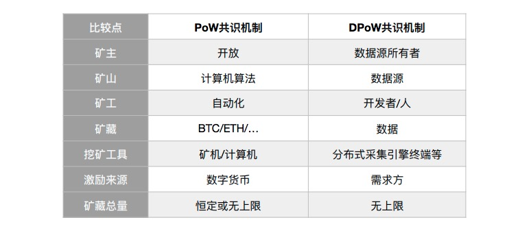 

DPoW 的激励来源于数据需求方支付的购买费用。若开发者所挖的矿山有版权归属者，购买费用部分将用于数据矿山所有者方分成。额外部分将用于超级节点和备用节点等生态环境贡献者的激励。超级节点及备用节点通过持币用户经平台投票系统竞选而来。    

发源链的数据挖矿可基于系统提供的分布式采集引擎终端进行。采集引擎的用户即生态的数据开发者。采集引擎兼容开发者和小白模式，可实现全民挖矿。开发语言将支持 Python、PHP、JAVA、Go、JS、Ruby 等主流编程语言。   

大数据矿山类似石油，如果不去开采，对社会没有任何价值。互联网公网、企业及政府机构内部都有海量数据矿山，但开采这些矿山必须要有完善的挖矿方案和良好的激励生态才能推动落地。发源链的DPoW数据挖矿及激励模型能最大化调动全民参与数据的采集、存储及流通应用，最终将极大提升社会数据的利用率，推动全球数据石油战略的快速落地。    

#### 2.5 数据生态架构

发源链生态主要包含发源链主链、侧链、超级智能合约及基于合约的去中心化应用市场。主链即发源链用于业务数据的存储及支撑整个生态的发展，侧链主要用于生态中流通数据的分布式去中心化存储。超级智能合约是发源链针对数据生态开发的AI智能合约，是生态中区块链部分和 DApps 之间沟通的桥梁。应用市场即基于发源链开发的应用集合。    

应用市场是整个发源链公有链生态的核心，DApps 将以数据上下行方式为生态做出贡献，衔接供需双方，同时也是整个生态安全流通的基础。发源链生态基础架构如下图所示：     

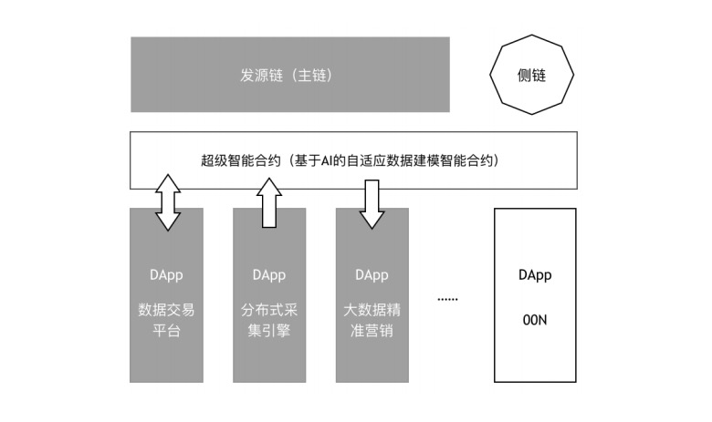     

发源链数据生态主要解决的关键点包括：    
  
- **数据授权**：所有数据都需要基于系统提供的授权合约进行上链，建立数据的HASH标识特征和数据块之间的唯一绑定关系。数据和数据 HASH 标识的耦合程度是100%的，只要原始数据的任一字符发生改变，HASH 都会相应变化。这是其它任何线下产品上链都不具有的耦合度优势。同步配合平台提供的SMA相似度匹配 (Similarity Matching) 算法、同态加密 (Homomorphic Encryption) 算法、安全交付模型及生态的信用机制，可完美保障数据安全和无版权纠纷，建立良好的生态基础。    

- **技术脱敏**：即在最大化保全数据应用价值的基础上，对数据中的敏感信息进行数据的改写或替换，实现敏感隐私数据的可靠保护。系统内置丰富的技术脱敏规则便于开发 DApps 时快速调用。数据经过技术脱敏处理，可从根本上解决隐私安全的问题。如个人姓名、手机号、身份证号及家庭地址等隐私数据，如果直接使用会导致个人信息的泄露，甚至更严重的问题，经过脱敏及系统AI建模处理后可安全交付使用。    

- **数据确权**：数据流通过程中的双向确权，即数据使用权的确定和数据所有权的确定。数据使用权的确定能保证数据的定向合法流通，让数据交付环节更加完善；数据所有权的确定能让数据开发者的上链数据永久有效，每当该数据被重复调用，数据开发者都会获得收益。数据的激励长期持续，有利于开发者的参与积极性。    

- **去中心存储**：数据生态系统的核心是数据。数据流通过程中会产生海量数据，为解决数据量过大而可能带来的区块冗余，发源链采用数据的去中心化存储。基于侧链通过HASH映射完成数据的存储。主链只存数据生态的基础信息，保证发源链的高性能和高扩展性。同时，系统存储成本也大大降低，去中心化存储更符合区块链的基本原则。   
 
- **点对点交付**：数据从采集存储到最终的交付过程中，透明流通但无任何中间方留存或缓存任何裸数据，从而解决传统中心化平台模式中的信任问题。用户也不用担心自身的数据被复制或盗用而带来的版权问题。点对点交付结合系统集成的数据同态加密算法和数据沙盒 (Sandbox) 应用算法可实现数据安全流通。    

- **信用机制**：基于区块链可建立完善的授权确权环境，且拥有强有力的可信共识机制。信用评价机制针对平台的所有用户建立信用模型，且永久上链存储，一旦出现信用问题系统可自动化执行相应的合约，通过溯源机制找到该用户，并执行相应的处罚。信用模型还可通过系统公平公正的投票系统和机器学习算法，不断完善不断学习。 

  
最终生态的数据流通架构图如下：    

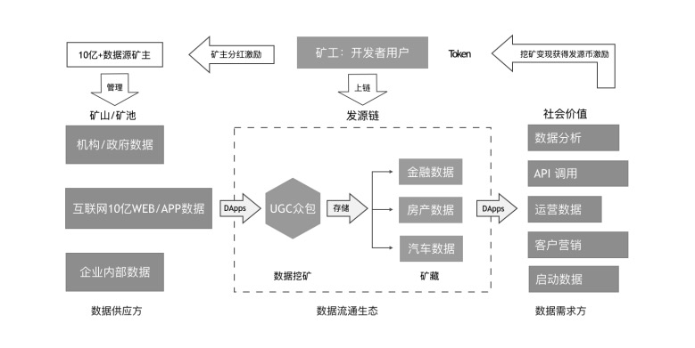    

发源链生态已沉淀20万分布式数据源节点，PB级数据源支撑，AI 建模模块具有先天性的海量样本数据优势。超级智能合约内置2000多种成熟的数据应用模型，基于人工智能及沙盒技术保障数据安全上链、链上交付，真正实现数据的安全流通，从根本上避免裸数据流通带来的版权隐私问题。    

发源链旨在打造全球数据的安全流通生态。目前已有成熟的 DApps 基于发源链生态开发，所有的 DApps 都将可以基于生态的海量数据源节点、成熟的工具组、极简的开发套件完成快速开发，最大化发掘数据源背后的价值。    

### 3、发源链应用市场

发源链是专门为数据生态设计的公有链。基于团队丰富的沉淀，已有多个落地应用场景。应用市场类似于苹果 AppStore。应用市场将自带数个 DApps，满足于生态用户的基本数据上下行需求。未来开发者将基于发源链开发海量 DApps，同时这些 DApps 会给发源链生态沉淀海量数据源资产和数据应用模型，其它开发者可基于这些沉淀做更深度的数据挖掘。数据作为新时代的石油，将会通过发源链生态真正实现价值最大化。应用市场部分应用如下：

#### 3.1 DApp1.数据交易平台

数据交易平台 DApp 是基于发源链开发的去中心化应用，可实现发源链生态数据的上下行流通。支持海量数据的分布式采集、存储及融合流通，从而以技术驱动数据交易发展。互联网开放数据及企业或政府机构内部数据通过“数据挖矿”机制众包采集接入，经确权授权脱敏等加工处理，以数据或算法规则等形态沉淀在交易市场，最终满足企业对数据分析、数据运营及精准营销等方面的需求。

数据供需双方可通过平台实现交易，且平台不对交易双方收取任何佣金也不留存数据。交付过程基于平台融合算法，通过主链验证，侧链调用的方式完成。数据需求方可购买现成数据或发布数据需求，也可直接使用采集引擎进行数据的采集；数据供应商和开发者，可在平台发布数据源产品和数据算法规则，也可接受需求者发布的定制订单。

#### 3.2 DApp2.分布式采集终端

分布式采集引擎终端 DApp 是基于发源链开发的一套开源分布式采集机器人节点引擎，主要用于“数据挖矿”和生态数据上行流通，致力于让用户快捷挖掘大数据矿山背后的价值。采集引擎终端集数据采集、清洗、去重、加工于一体的互联网 WEB/APP 结构化数据及数据块数据采集引擎，支持私有节点部署或服务生态，可以打破数据孤岛，快速搭建属于自己的大数据云采集/爬虫系统，或为生态贡献数据获取收益。    

生态用户可以低成本、高效率完成网页中文本，图片等资源信息的采集，并进行过滤加工，挖掘出精准所需的数据，让数据以结构化的文件包、采集规则算法或  API 接口方式输出，同时可以选择发布到数据交易平台进行交易，或导出为 Excel、CSV、SQL 等格式的文件保存在本地。   

#### 3.3 DApp3.精准营销平台

精准营销平台 DApp 是基于发源链开发的大数据精准营销平台产品，主要场景是基于发源链生态海量数据的下行应用。     

精准营销是大数据时代非常时髦的一个营销术语。大致意思就是充分利用各种新式媒体，将营销信息推送到比较准确的受众群体中，从而既节省营销成本，又能起到最大化的营销效果。这里的新式媒体，一般意义上指的是除报纸、杂志、广播、电视之外的媒体。    

精准营销平台DApp是基于发源链生态海量数据源融合的去中心化应用，通过用户画像模型的使用，可将个人数据脱敏加标签化关联，最终以“结果”形态服务于客户需求。用户行为画像是从真实的用户行为中抽象出来的典型用户模型，企业通过收集与分析消费者用户的社会属性、生活习惯、消费行为的主要信息之后，完整描述产品或服务的目标用户特征，为企业中所有与用户有关的决策过程提供信息基础，指导企业的产品服务研发和市场营销。用户行为画像的核心在于给用户“打标签”，每一个标签通常是人为规定的特征标识，用高度精炼的特征描述一类人，例如年龄、性别、兴趣偏好等，不同的标签通过结构化的数据体系整合，就可与组合出不同的用户行为画像。这一核心需求适用于各行业的精准营销业务场景。     

相比传统的精准营销平台，基于发源链生态的精准营销平台 DApp 可完美实现数据源安全流通并落地应用，从根本上100%解决数据版权隐私问题，是发源链下行生态的应用，具有划时代的、颠覆性的意义。    

### 4、Token经济模型

#### 4.1 应用场景

发源链生态主要用户群体包括：数据需求方、数据供应商和数据开发者。数据需求方即为有数据应用需求的用户，数据供应商指有数据源权限并将数据源接入生态变现的用户群体，数据开发者即提供挖矿服务和开发 DApp 的用户群体。如下图：    

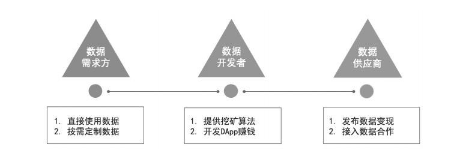  

发源链生态的通证 (Token) 应用场景主要包括：    

- **生态流通**：生态系统、交易平台等 DApp 流通的货币；    

- **节点激励**：超级节点、备用节点的激励；    

- **上游变现**：数据供应商接入数据变现的激励；    

- **下游支付**：数据需求方调用数据支付的费用；    

- **挖矿激励**：数据开发者数据挖矿的激励；   

- **其它激励**：发源链生态管理、投票及运营等其它地方的激励。    

基于以上 Token 应用场景，发源链生态中数据供应商、需求方和开发者都将会通过应用市场中的各个 DApp 载体，参与到生态中，发挥各自的价值。完整的应用场景列举如下：    

生态应用场景一：    

> 某科研机构在做人工智能 AI 的机器学习研究，需要1万种中国汉语方言随机样本数据，如一段话300个汉字的方言录制。该机构可以通过系统数据交易 DApp 发布一个 Token 激励的需求任务，平台的百万用户在需求列表看到需求后可通过系统的数据采集引擎快速完成并提交，数据 HASH 上链并永久保存，数据在侧链存储，且其他人没有权限查看。需求方可在几分钟内完成任务的多样化定制，且满足随机的方言分布需求。沉淀的该数据集被重复调用，开发者也重复获得 Token 激励。    

生态应用场景二：    

> 某企业做商标知识产权行业分析报告，需要采集政府商标网站公开的2600万条商标数据。通常自身技术团队或第三方外包团队写技术代码完成采集评估成本在18万左右，交付周期3个月。该企业可使用系统提供的分布式采集引擎 DApp 快速完成数据的采集，或使用交易平台 DApp 发布 Token 激励的需求任务。发布需求任务时百万开发者按商标 id 切片接单，每人平均完成260条数据的采集即可。极大加速了任务的完成，且无需考虑技术难点层面的问题。无论是自行采集或需求众包的数据集，沉淀后均可重复调用长期获得 Token 激励。    

生态应用场景三：      

> 某精准营销广告公司做底层广告投放系统建设，需要海量用户画像标签数据做模型优化。可直接自行开发 DApp 使用生态中的海量用户画像数据，或基于系统的精准营销 DApp 直接调用用户画像数据 API，或根据标准化的加密设备ID做索引通过数据交易平台发布需求任务，快速收集多方数据源开发者接入的数据，通过智能合约做数据调用后的过滤并确权，最终可完成市场上大多数的主流用户画像数据，查得率、覆盖率及模型精准性都得到极大提升。该需求的多方数据源在接入时能得到授权脱敏支撑，且数据能长期获得收益，需求方也低成本、高效率地完成业务需求。    

#### 4.2 Token 发行方案

发源币为基于以太坊 ERC20 标准的代币，由新加坡发源链基金会发行。发行总量为10亿枚，数量恒定，永不增发。发源链生态具有完善的通缩自治模型，随着用户、数据资源及应用场景的的不断增加，未来将会根据生态发源币流通量及市场供需做出动态优化，保障生态市场经济的完美运行。    

发源链致力打造全新的区块链数据生态系统，将使用发源币 Token 作为流通数字货币，未来会将流通的数据的全部建立在区块链上，通过全球多国平台运营团队，推动发源链生态系统的全球化运作。    

募集规划：软顶5,000ETH，硬顶50,000ETH。具体分配方案如下图所示：    

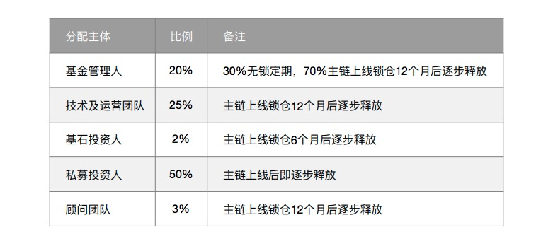     
    
此分配方案可能会根据各融资阶段的各地区市场和监管的实际情况进行调整，但不会调整发行总量。截止发行结束为止，被认购分配的发源币将构成可用流动供应量的全部。    
*注：逐步释放指锁仓期满后每月释放持币总量的3-6%，具体根据智能合约执行。*       

#### 4.3 资金使用规划

筹集的 ETH 将主要用于技术研发与市场营销。部分资金用于技术研发升级，以不断提高平台生态的技术水平；部分用于市场营销和运营维护，主要用于提高项目的知名度，以吸引更多的开发者用户参与到发源地的生态建设中；剩余部分用于公关费用和机动使用，以拓展尽可能多的交易所支持发源币的交易等。如下表所示：     

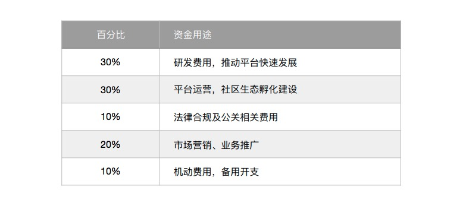  

#### 4.4 投资优势分析

**团队优势：**    

多年数据交易、区块链领域领先的核心团队打造。有上万个行业数据模型及丰富的真实用户需求的案例支撑，且对行业痛点有深入的理解。    
    
**技术沉淀：**    

拥有多年分布式和区块链行业的沉淀，及数千台服务器的分布式采集、存储架构经验。可将开发周期大大缩短，快速落地。    

**数据沉淀：**    

20万分布式数据源节点及PB级数据沉淀。基于中心化平台的产品升级及百万用户沉淀，可实现 Token 的快速应用流通，提升社区生态的活跃度。远离空气链、空气币。    

**风口优势：**    

大数据时代，通过发源链数据挖矿，可推动全球“数据石油”战略的快速落地。同时平台提供 ToC 和 ToD 的挖矿模式，可实现全民挖矿，市场空间和社会价值巨大。    

### 5、团队构成

#### 5.1 核心团队

发源链拥有一个非常有经验的核心团队，成员具有多年的区块链和数据交易行业的经验。核心团队均拥有本科或研究生以上学历。主要成员简介如下：    

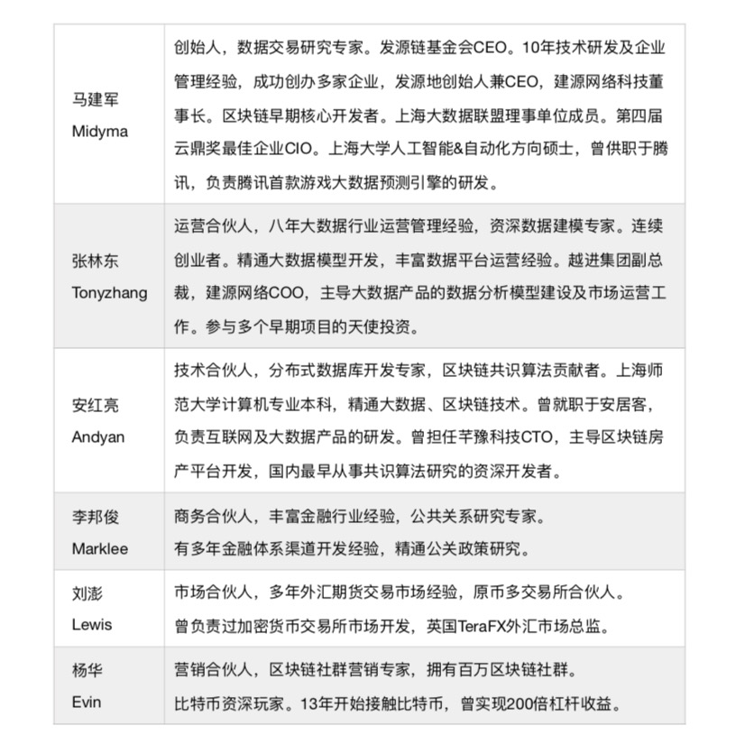 

#### 5.2  投资人及VC机构

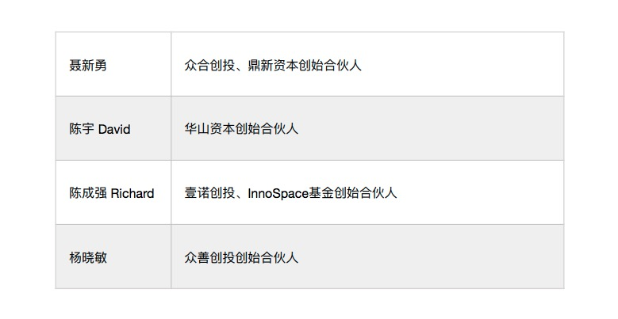 

另外部分 Token Fund 投资机构如下:

> 连众资本、永创联投、如来资本、琸普资本、伽曦资本等全球新兴区块链基⾦金金。    

### 6、发展与规划

#### 6.1 发展历程

**2015年：** 团队成立，启动大数据交易平台项目；获得壹诺创投、InnoSpace 天使基金的数百万元投资；分布式数据采集引擎1.0发布，并启动区块链技术研究；    

**2016年：** 中心化大数据交易平台上线，开发者用户突破10万；完成国内首个区块链分布式存储系统内网测试；各行业数据模型突破500个；    

**2017年：** 获得众合资本、华山资本、众善创投的数千万元投资；正式投入区块链研发。开发者用户突破30万，月交易额突破300万元；    

**2018年：** 数据源全球优质节点突破20万个，每个节点索引 TB 级别或数亿级别数据。同时，发布区块链白皮书，全面引入区块链链接数据源节点，致力打造数据生态系统。      

#### 6.2 时间规划

**第一阶段：**    

**2018 Q1** 结合区块链技术来解决行业问题，启动项目社群运营；    
 
**2018 Q2** 与发源链基金会达成战略合作。通过产品模型验证并发布项目白皮书1.0；    

**2018 Q3** 启动 Token 发行和募资，上线交易所，全球宣传推广。启动主链研发；    

**2018 Q4** 登录5家以上主流交易所。完成基础架构开发并主链上线。    
   
**第二阶段：**    

**2019 Q1** 启动发源链 DApp 开发。应用市场正式开放，全球开发者推广；  
  
**2019 Q2** 完成相关工具组开发，包括区块链钱包和浏览器等；    

**2019 Q3** 不断升级 AI 模型库及超级智能合约、数据接口对接、生态用户营销推广；  
  
**2019 Q4** 完成100个 DApps 上线，成功孵化10个大数据AI方向的成功应用；  
  
**2020 Q1-Q2** 产品整体市场运营、全面宣传、营销推广；    

**2020 Q3-Q4** 社区运营建设、平台运营维护，不断迭代完善。    

**第三阶段：**     

**2021 Q1-Q4** 产品宣传推广，进入中国数据市场第一梯队；   
 
**2022 Q1-Q4** 拓展海外市场，进入欧美日韩新加坡等全球数据市场。    
   
### 7、项目声明

本白皮书仅作为传达信息之用，文档内容仅供参考，不构成任何个人及相关机构对发源币的任何投资买卖建议、教唆或邀约。   

发源币在募资开始之前已于新加坡成立非盈利基金会 ，该基金会的主要任务是发起项目融资，公开、公正和透明的运营代币生态 ，并对代币的开发团队进行管理。同时基金会已聘请专业的法务律师团队给予业务开展所需的相关法律法规支持。    

尽管如此，仍可能会有一些不可抗力的影响。如目前各国对于区块链项目的监管政策尚不明确，存在一定的因政策原因而造成参与者损失的可能性。同时，由于数字资产交易领域目前尚缺乏明确的监管规则，Token 存在暴涨暴跌或相关操控风险，参与者入市后若缺乏经验，可能难以抵御市场不稳定所带来的资产浮动冲击与心理压力。如果整体数字资产市场价值被高估，那么投资风险将加大，参与者若抱有过高期望，则可能无法实现。另外本项目基于最新技术及密码学算法所构建，技术的迅速发展会带来潜在的黑客攻击和相关安全风险。项目在更新迭代过程中，可能会发现有漏洞存在，虽可通过发布补丁的方式进行弥补，但并不一定能完全保证漏洞所致影响的各个方面。    

基于以上原因，请参与者在充分了解团队背景、项目整体框架与生态模式的基础上，合理调整自己的愿景，理性参与。    

### 8、参考文献

[1] Jorge Izquierdo. The new operating system for protocols and DApps, https://blog.aragon.one/introducing-aragonos-3-0-alpha-the-new-operating-system-for-protocols-and-dapps-348f7ac92cff, 2018.     
   
[2] Cryptonomex. https://github.com/cryptonomex/graphene.     

[3] 龚鸣.《区块链社会 解码区块链全球应用与投资案例》2016.      

[4] Joseph Poon, Thaddeus Dryja. The Bitcoin Lightning Network: Scalable Off-Chain Instant Payments, 2016.    

[5] GeGao. http://36kr.com/p/5075070.html.     
  
[6] Vitalik Buterin. Explanation of DAICOs, https://ethresear.ch/t/explanation-of-daicos/465, 2018.    

[7] Vitalik Buterin. On Medium-of-Exchange Token Valuations, https://vitalik.ca/general/2017/10/17/moe.html, 2017.    

[8] Conner Fromknecht. Connecting Blockchains: Instant Cross-Chain Transactions On Lightning, https://blog.lightning.engineering/announcement/2017/11/16/ln-swap.html, 2017.    
[9] CAICT. http://www.caict.ac.cn/kxyj/qwfb/bps/, 2018.    

[10] Matus Lestan, Joe Urgo, Alexander Khoriaty. district0x Network: A cooperative of decentralized marketplaces and communities, 2017.    

[11] 黄世亮. 拒绝付款套利攻击——比特币场外交易的一种攻击手法及防范, https://mp.weixin.qq.com/s?__biz=MzIxNTA0NDQzMA==&mid=2651798518&idx=1&sn=4e91bac98cea5bc600e8429f1af3a728, 2017.     

[12] RSK Labs. Sidechains, Drivechains, and RSK 2-Way peg Design, https://www.rsk.co/blog/sidechains-drivechains-and-rsk-2-way-peg-design, 2017.    